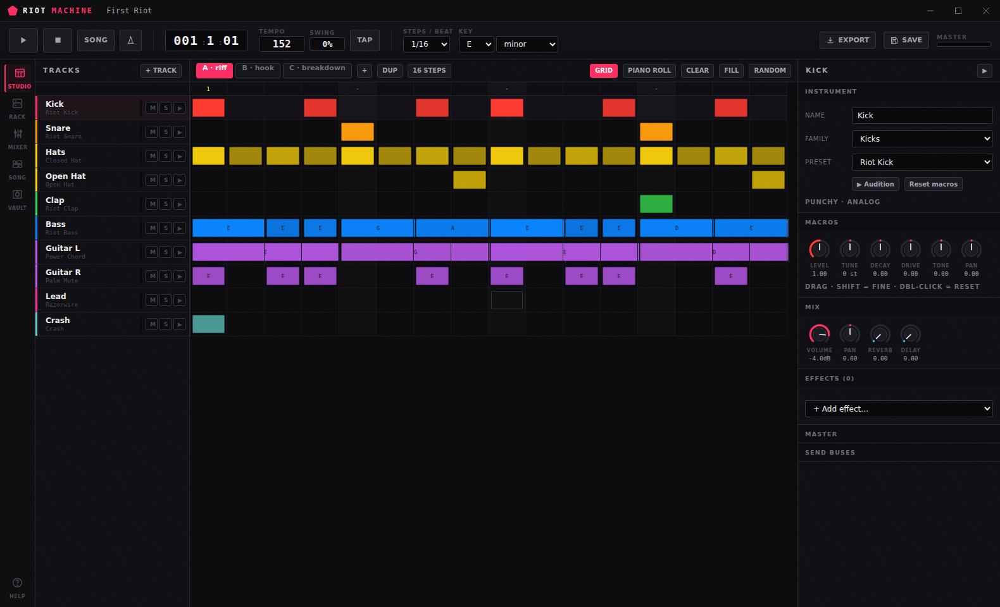
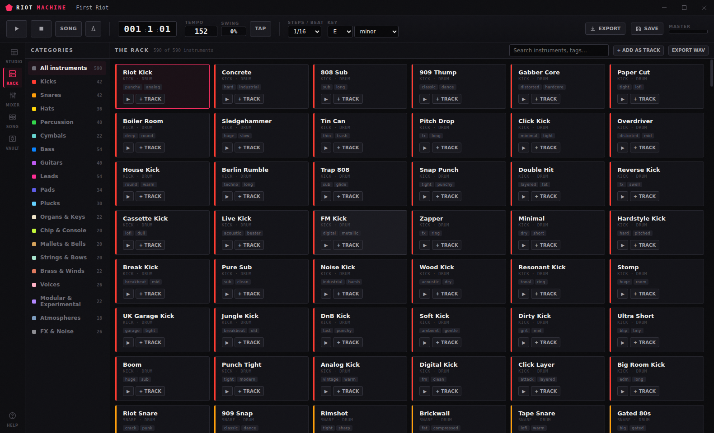
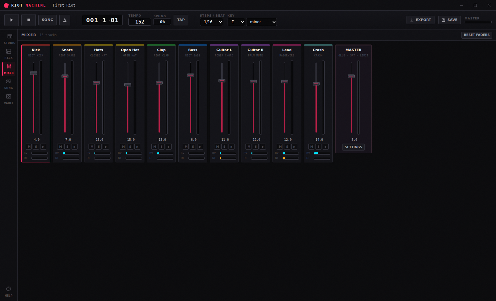
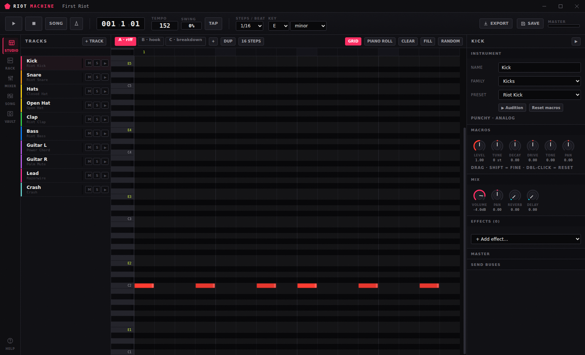
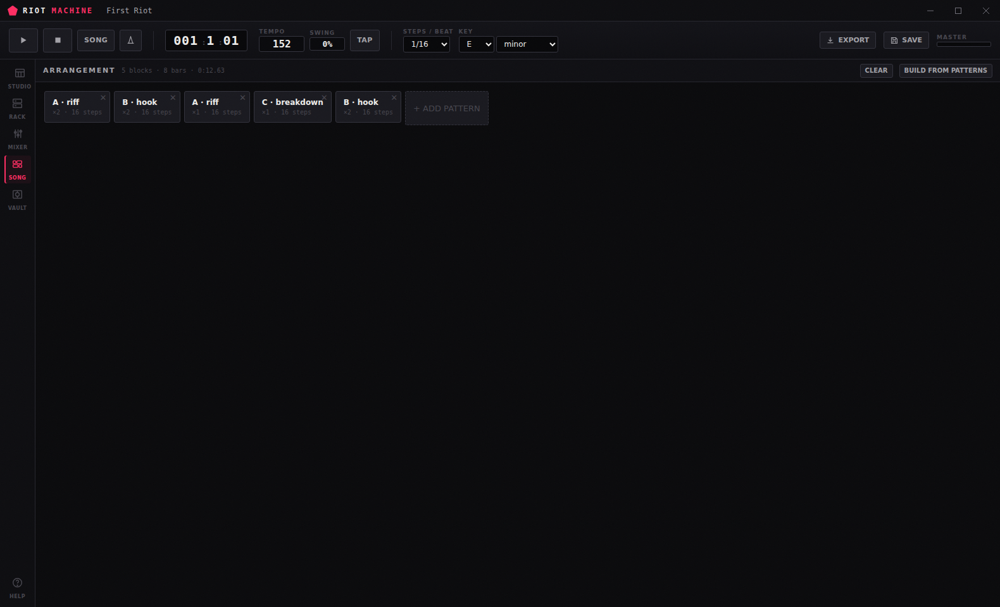
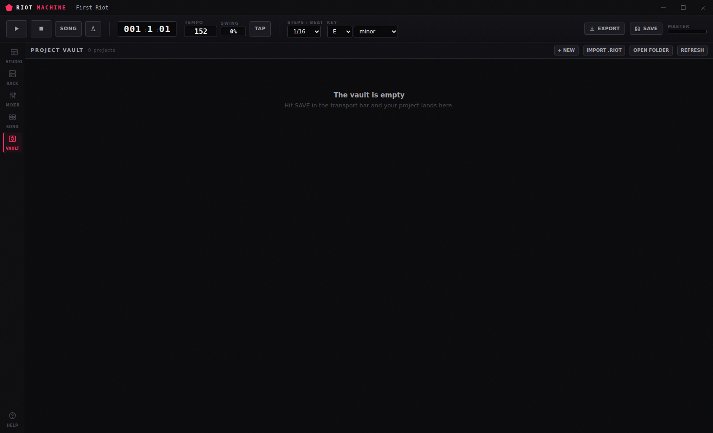
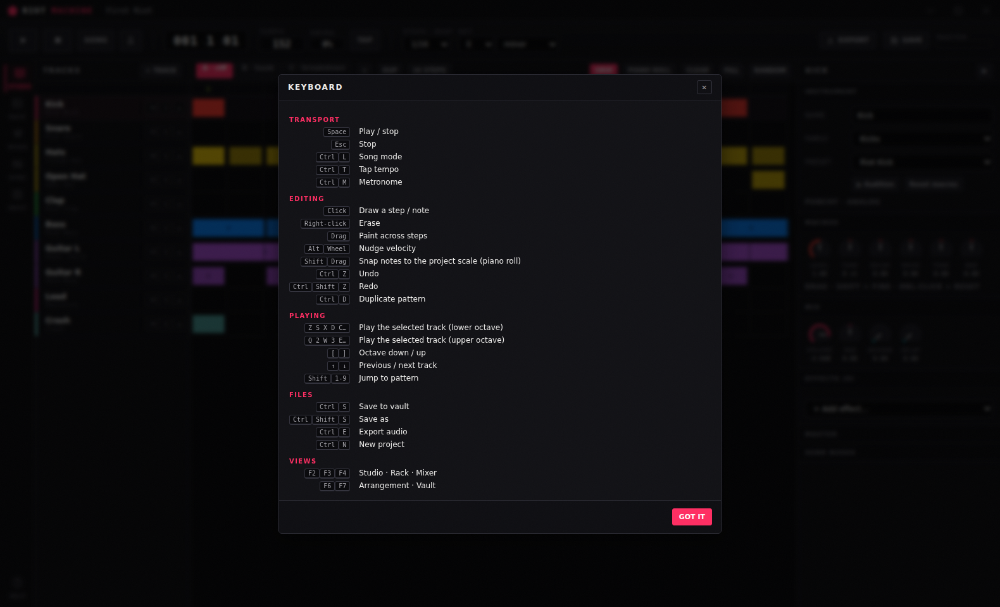

# RIOT MACHINE

A punk electronic music studio that installs as a Windows program and runs entirely offline.

**590 instruments, all synthesised** — no sample library, no downloads, no account. Write patterns on a step grid or a piano roll, arrange them into a song, mix them, and bounce the result to WAV or MP3.



---

## What's in it

| | |
|---|---|
| **590 instruments** | 19 families: 42 kicks, 42 snares, 36 hats, 40 percussion, 22 cymbals, 54 basses, 40 guitars, 54 leads, 34 pads, 30 plucks, 22 organs & keys, 20 chip & console, 20 mallets & bells, 20 strings & bows, 22 brass & winds, 26 voices, 22 modular & experimental, 18 atmospheres, 26 FX. Every one is a distinct patch for the synthesis engine — see [docs/INSTRUMENTS.md](docs/INSTRUMENTS.md). |
| **Editing** | Step grid for the whole pattern, piano roll per track, velocity, note length, probability, swing, scale snapping, 1–128 steps per pattern, unlimited patterns. |
| **Instrument editor** | Per-track macros (tune, cutoff, resonance, filter envelope, drive, FM, LFO, glide, envelopes) layered on top of the preset, plus up to six insert effects per track. |
| **Effects** | Drive (10 curves), bitcrusher, filter with LFO, chorus, phaser, ping-pong delay, convolution reverb (7 spaces), compressor, EQ, trance gate, auto-pan/tremolo, ring modulator, stereo width, vinyl noise floor. |
| **Mixer** | Per-track fader, pan, mute, solo, two global send buses (reverb and delay), live meters, and a mastering chain: EQ → saturation → width → glue compressor → limiter. |
| **Preview** | Audition any instrument with one click, play the selected track from your computer keyboard, or loop a pattern while you edit it. |
| **Download** | Offline render to WAV (16/24-bit or 32-bit float) or MP3 (128–320 kbps) at 44.1, 48 or 96 kHz. Bounce the arrangement, one pattern on repeat, a single instrument, or every track as separate stems. |
| **Storage** | A local project vault: save, open, rename, duplicate, delete. Projects are plain `.riot` JSON you can import and export. The current session is also cached, so closing and reopening picks up where you left off. |

---

## Install (Windows)

Run **`RIOT-MACHINE-Setup-1.0.0-x64.exe`**.

It is a normal NSIS installer: it asks where to put the program, adds a Start Menu entry and a desktop shortcut, and can be removed from *Apps & features* like anything else. It installs per-user by default, so it needs no administrator rights.

The installer is not code-signed, so SmartScreen will show "Windows protected your PC" the first time. Choose *More info → Run anyway*.

Where your files live after installing:

```
%APPDATA%\RIOT MACHINE\vault\      your saved projects (.riot)
%APPDATA%\RIOT MACHINE\renders\    bounces written with "save to renders folder"
```

Both folders are reachable from **Help → Open project vault folder** inside the app.

---

## A first pass through the app

1. It opens on a demo project called **First Riot** — hit `Space` and you'll hear it.
2. **Rack** (`F3`) lists all 590 instruments, grouped into 19 families. Click one to audition it, `+ TRACK` to add it to the project.
3. **Studio** (`F2`) is the sequencer. Click cells to draw notes, right-click to erase, drag to paint a run. `PIANO ROLL` switches the selected track to a pitch editor.
4. The right-hand panel edits whatever track is selected: swap its preset, turn the macros, add effects.
5. **Song** (`F6`) chains patterns into an arrangement. Scroll on a block to change how many times it repeats.
6. **Mixer** (`F4`) balances everything.
7. `Ctrl+E` bounces it to a file. `Ctrl+S` saves it to the vault (`F7`).

### Keyboard

| | |
|---|---|
| `Space` / `Esc` | Play–stop / stop |
| `Ctrl+L` | Song mode (play the arrangement instead of one pattern) |
| `Ctrl+T` / `Ctrl+M` | Tap tempo / metronome |
| Click · right-click · drag | Draw · erase · paint |
| `Alt`+wheel | Nudge a note's velocity |
| `Shift`+drag | Snap piano-roll notes to the project scale |
| `Z S X D C…` / `Q 2 W 3 E…` | Play the selected track, lower and upper octave |
| `[` `]` | Octave down / up |
| `↑` `↓` | Previous / next track |
| `Shift`+`1`–`9` | Jump to a pattern |
| `Ctrl+Z` / `Ctrl+Shift+Z` | Undo / redo |
| `Ctrl+S` · `Ctrl+E` · `Ctrl+N` | Save · export audio · new project |
| `F1` … `F7` | Help, Studio, Rack, Mixer, Song, Vault |

---

## Screenshots

| Rack | Mixer |
|---|---|
|  |  |

| Piano roll | Arrangement |
|---|---|
|  |  |

| Project vault | Help |
|---|---|
|  |  |

---

## Building it yourself

Requires Node 18 or newer.

```bash
npm install         # pulls Electron and electron-builder
npm start           # run the app from source
npm run verify      # boot the real app and assert 20 end-to-end checks
npm run dist:win    # -> dist/RIOT-MACHINE-Setup-1.0.0-x64.exe
```

`npm run dist:win` works on Windows, Linux and macOS alike. It runs in three steps, each its own script:

| | |
|---|---|
| `scripts/make-icons.js` | draws the app icon and writes `icon.ico` / `icon.png` — a small rasterizer, PNG via zlib, ICO by hand. No image library. |
| `scripts/make-installer-art.js` | draws the installer's sidebar and header as BMPs, including a 5×7 bitmap typeface for the wordmark. |
| `scripts/make-installer.js` | has electron-builder package the app into `dist/win-unpacked`, then compiles the NSIS installer with `makensis` directly. |

`npm run docs` regenerates [docs/INSTRUMENTS.md](docs/INSTRUMENTS.md) from the rack tables, so the catalogue cannot drift from the code.

That last step is deliberate. electron-builder's own NSIS target *executes* the finished installer during the build to produce its uninstaller, which needs a working 32-bit Windows loader and therefore Wine on any non-Windows host. A classic `WriteUninstaller` script does not, so the installer script is generated and compiled here instead — `dist/riot-installer.nsi` is written out on every build if you want to read it.

`npm run dist:win:fast` recompiles the installer from an existing `dist/win-unpacked` without repackaging, which turns a five-minute cycle into about ninety seconds.

`npm run verify` is the real test: it launches the app under a real Chromium, renders all 590 instruments offline, checks that none of them is silent, bounces the demo song, encodes it as WAV and MP3, runs the transport, and exercises undo and every view. It passes both against the source tree and against the packaged app, so the asar and AudioWorklet paths are covered too.

---

## How it works

```
electron/
  main.js              window, menus, the app:// protocol, vault and file IPC
  preload.js           the only API surface the renderer can see
src/
  index.html           the shell
  css/app.css          the whole visual system
  js/
    app.js             controller: project state, views, transport, shortcuts
    audio/
      dsp.js           wavetables, distortion curves, noise, impulse responses
      voice.js         one note in, one voice graph out (synth and drum)
      fx.js            the effect units
      engine.js        mixer graph, scheduler, offline render
      worklets/        bitcrusher and saturator AudioWorklet processors
    data/
      instruments.js   the index: families, defaults, field reference
      rack/            one module per family, 590 instruments in total
    state/project.js   the project model, migration and the undo stack
    ui/                sequencer, inspector, rack, mixer, song, vault, export
    lib/               helpers, WAV encoder, MP3 bridge
```

Two ideas hold the audio side together:

**One graph builder, two contexts.** `buildGraph()` assembles the mixer identically in the live `AudioContext` and in the `OfflineAudioContext` used for rendering, and every voice is fully scheduled ahead of time rather than driven by callbacks. What you hear is what gets exported, sample for sample.

**Instruments are data, not samples.** An instrument is an oscillator bank, an optional sub and noise layer, an FM operator, a filter with its own envelope, an amp envelope, an LFO and a waveshaper — described as a plain object. That is why 590 instruments cost a few kilobytes and render correctly at 96 kHz.

The renderer is plain ES modules with no build step. It is served over a custom `app://` scheme so modules and AudioWorklets load under a strict CSP, with `contextIsolation` on and Node disabled in the renderer.

---

## Licence and credits

The application is MIT licensed.

MP3 export uses **LAME** through [`@breezystack/lamejs`](https://www.npmjs.com/package/@breezystack/lamejs), which is LGPL-3.0. It is vendored unmodified at `src/js/lib/vendor/lamejs.iife.js` and loaded as a separate library at runtime; its licence is at `src/js/lib/vendor/LAME-LICENSE.txt`. LAME's home is <https://lame.sourceforge.io/>. WAV export is written by this project and has no third-party code in it.

Everything else — every instrument, every effect, the icon — is generated by code in this repository.
